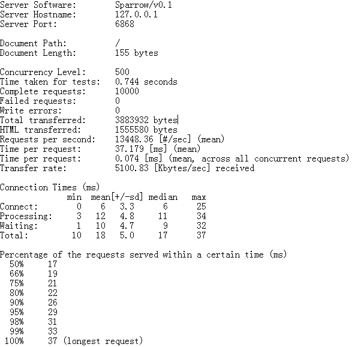
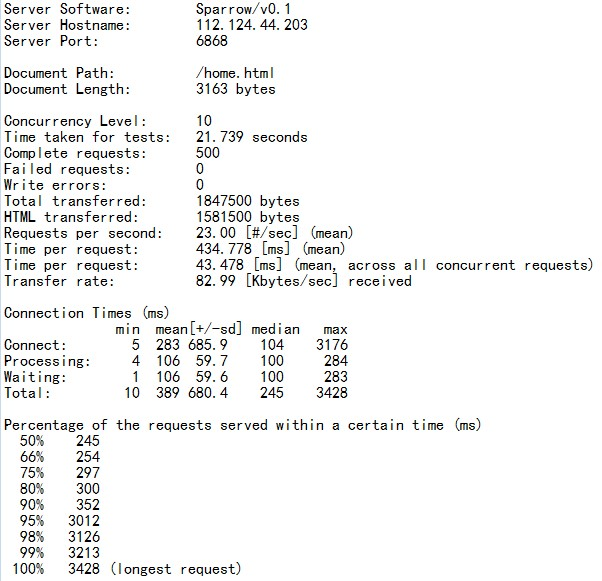
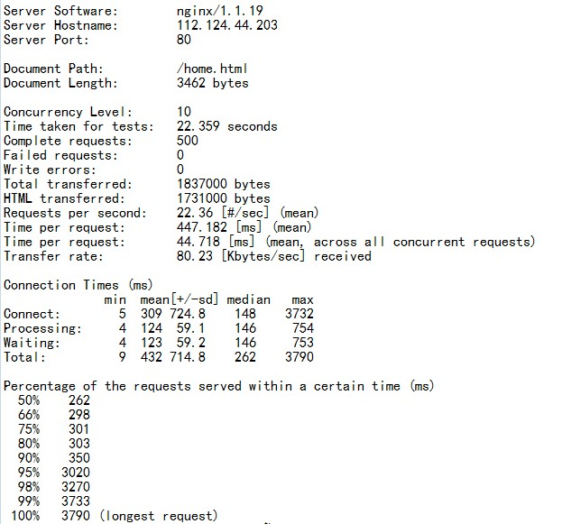

#Sparrow

`sparrow` 是一个简单高效的http server，纯C语言开发，目前主要用在本人个人的网站.

---------------
#online demo

  * [@blog](http://chengshuguang.com)
  * [@chat room](http://chengshuguang.com/ajax.html)

---------------
#News
  * 2015-04-10日晚11:20分:
   
   问题:对于异步日志，当程序奔溃的时候(SIGSEGV)，在内存中得log还没有来得及写入disk。 

   添加了捕获SIGSEGV逻辑，当发生段错误的时候，把内存中得日志，写入到disk。

  * 2015-03-27日晚10点22分：
   
   通过`lsof -p pid`来观察线上服务器的打开文件时，发现竟然上千，全部指向几个.html文件。
   测试，发现，仅当304的时候，打开文件数会不断上升，即：304发生时，没有关闭对应打开的文件。
   解决方案：304之前，不需要打开请求的文件，全部待304确定之后，在看有没有必要打开。

  * 2015-03-26日凌晨1点：
    
   修掉一个严重bug，该bug会导致stack smashing.
  
   原因：`sprintf() 会导致数组溢出`。 解决：全部用`snprintf()`替换掉。指定最大长度。

----------------
###How To Use
   * make
   * 在config/sparrow.conf中配置server。[可选]
   * ./sparrow
   * open in browser http://127.0.0.1:xxxx/ [端口xxxx, config/sparrow.conf中配置]
   * http://127.0.0.1:xxxx/myfolder To Test Folder
   
----------------
###功能
   * 支持GET（POST暂时不支持)
   * 支持目录的访问
   * 支持多线程（可配置工作线程数目）
   * 非阻塞I/O
   * 支持sendfile, tcp_cock等高效操作
   * 支持404， 500
   * 支持304 not modified
   * 支持长连接，http Keepalive,不支持http pipeling
   * 支持定时任务（timerfd + 最小堆)
   * 支持异步的日志：
       * 支持零点自动切换日志文件
       * 完善清晰的格式
       * 多线程支持
   * 支持epoll
   * 支持文件配置
   * 不依赖任何第三方库

-----------------
###待续...
   * timer heap大小是固定的，超出会崩溃(由于很多cb为空的timer存在)
   * __大量并发连接的情况下，偶尔会出现少量close_wait情况：初步分析如下，目前的连接关闭都是在服务端主动关闭，客户端被动关闭，但是在服务端只注册了可写事件的时候，此时客户端主动断开，那么无处处理断开导致的可读事件去close，出现close_wait__
   * __bug:当目录下文件过大时，buf溢出问题__
   *  均衡工作线程的地方，现在用的是随机分配，增加统计每个线程中的任务数，然后分配
   * how to reduce time\_wait in server side? May be it will work that [close() when finishing a request in server side -->   register EV\_READ. send connection close in http header, thus client closing the conn actively!]
   * chunked 编码支持

   * __bug:在网速基本为0的情况下，连接远端服务器，结果把log输入到了网页，未重现__
   * 添加一个检测程序，当程序死掉或者不能访问的时候， 重启进程。（确保存活，并确保线程没有崩）(一个检测shell，确保进程存活同时网络可用，epoll出错后直接退出。)
   * 添加音乐服务
   * 项目栏目，增加标签/关键字，比如：C，JAVA, 多线程，网络等

   * __bug:在网速基本为0的情况下，连接远端服务器，结果把log输入到了网页，未重现（问题找到了：因为配置文件默认log是开启的，然后再配置文件还没有加载完的时候，连接先过来了，那么还是按默认的要打印log，但是输出到网页，我想应该是刚好的打开log的文件的fd一样了？具体在分析）__
   * 添加一个检测程序，当程序死掉或者不能访问的时候， 重启进程。（确保存活，并确保线程没有崩）
   

----------------
###笔记
   * 2014-9-16: fix bug of image corrupt and segment err (http_code not init)
   * 2014-9-17: 解决大量请求的时候服务器崩溃。原因：clear()操作放到了close(fd)之后，在多线程的环境下，当线程1执行完了close(fd),此时在clear之前被线程2打断，线程2重用了上面的fd，并执行后续操作，但是当线程1恢复过来继续执行clear()操作,却把fd重置了，那么线程2在执行fd相关操作的时候就会出现Segmentation Fault.(PS: 多线成环境下找到SEG ERR 发生的点还真是不容易，分析了core文件，勉强出现的信息还能看，但是不具体，为什么？).
   * 2014-10-1:增加一个日志开关，可以选择
   * 2014-10-2: bug:解决多线程环境下，高并发的时候会出现 epoll_ctl add 出错，报错File  exist。
   error in multithreaded program "epollControl: does not exist (No such file or directory)"单线程不会出错，肯定是多线程的时候某个地方没考虑到. __epoll_ctl man page tells me that the reason for this error is:"ENOENT: op was EPOLL_CTL_MOD or EPOLL_CTL_DEL, and fd is not in epfd."__
   _错误是连接退出是active应该没有被重置_
   * 2014-10-3:增加了配置文件，并重构了代码，tag v0.09
   * 2014-10-10:解决,当连接超过max_event时会发生数组溢出而崩溃，所以需要限制连接，设置一个最大值
   * 2014-10-14:解决,url中包含中文而不能匹配文件名的问题。
   * 2014-10-15:fix bug:__目录下输出的子目录和文件排序问题__
   * 2014-10-17:fix bug:目录名中含有小数点'.'访问出错
   * 2014-10-19:增加个人website前端模板

##性能测试(offline/online)(_sparrow VS nginx_)
_note: 这并不是一个公平的性能对比，由于本人对nginx并不是那么的熟，nginx基本上就是用的默认的配置，而且nginx的版本也不是很新。以下对比仅仅是一个粗略的参考_

`cpu: Intel(R) Core(TM) i3-2100 CPU @ 3.10GHz , 4 cores; mem: 1G`

-----------------
##Offline
####ab 测试
`ab -n 10000 -c 500 http://127.0.0.1:xxxx/`

__sparrow__

__nginx__

------------------
####webbench 测试
`webbench -c 500 -t 60 http://127.0.0.1:xxxx/`

__sparrow__

__nginx__

-----------------
##Online
`阿里云，1核cpu，1G内存，1M带宽，Ubuntu12.04`

`ab -n 500 -c 10 http://xxx.xxx.xxx.xxx:xxxx/`

__sparrow__

__nginx__

`webbech -c 500 -t 60 http://xxxx`

`sparrow, nginx respectively`

