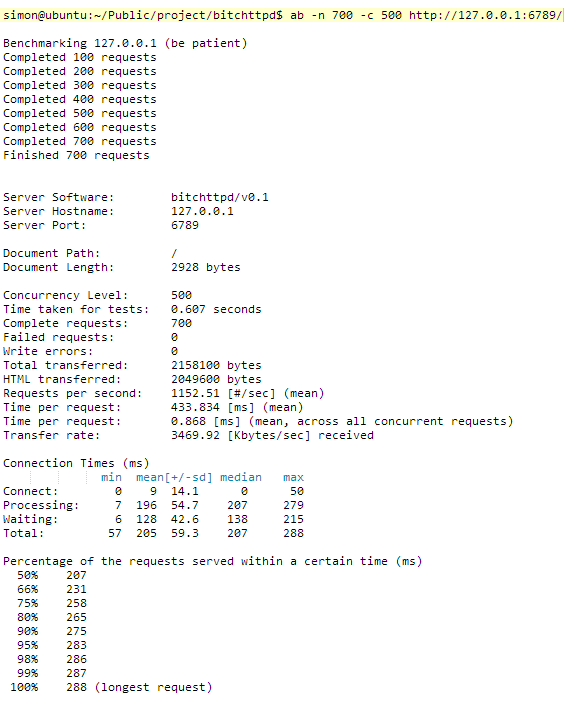

#bitchttpd

`bitchttpd` 是一个简单高效的http server，纯C语言开发，目前主要用在本人个人的网站。

###功能
* 支持目录的访问(自定义格式)
* 支持多线程（可配置工作线程数目）
* 支持sendfile, tcp_cock等高效操作
* 支持404， 500
* 支持304 not modified
* 支持异步的日志：
    * 支持零点自动切换日志文件
    * 完善清晰的格式
    * 多线程支持
* 支持epoll
* 不依赖任何第三方库

###待续...
* bug:当目录下文件过大时，buf溢出问题
* 目录下输出的子目录和文件排序问题（根据阅读次数排序）
*  close, clear , ev_unregister overlap some operations.
*  catch control: max-age 竟然没有起到作用
*  均衡工作线程的地方，现在用的是随机分配，增加统计每个线程中的任务数，然后分配
* how to reduce time_wait in server side? May be it will work that [close() when finishing a request in server side -->   register EV_READ. send connection close in http header, thus client closing the conn actively!]
* 当连接超过max_event时会发生数组溢出而崩溃，所以需要限制连接，设置一个最大值。
* chunked 编码支持

###Note
* 2014-9-16: fix bug of image corrupt and segment err (http_code not init)
* 2014-9-17: 解决大量请求的时候服务器崩溃。原因：clear()操作放到了close(fd)之后，在多线程的环境下，当线程1执行完了close(fd）),此时在clear之前被线程2打断，线程2重用了上面的fd，并执行后续操作，但是当线程1恢复过来继续执行clear()操作,却把fd重置了，那么线程2在执行fd相关操作的时候就会出现Segmentation Fault.(PS: 多线成环境下找到SEG ERR 发生的点还真是不容易，分析了core文件，勉强出现的信息还能看，但是不具体，为什么？).
   
###粗略的性能测试(700请求，并发500，1G内存，1核cpu)

`毫无压力啊！！`对于本人用来托管博客文章之类的，妥妥的

`后续会有更高性能的测试和大文件的测试`

